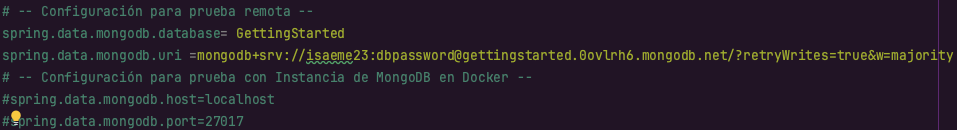
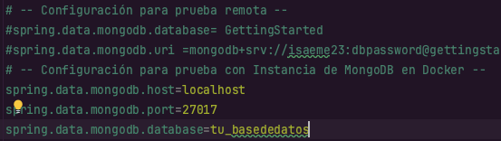

<h1 align="center">

LogService

</h1>

## Introducción
Es un servicio REST que recibe una cadena, la almacena en la base de datos y responde en un objeto
JSON con las 10 últimas cadenas almacenadas en la base de datos y la fecha en que fueron
almacenadas.

## Instalación
Para poder instalar y usar este proyecto, se necesitará:
* Git.
* Maven.
* Java.
* Intellij o alguna IDE.

En la terminal de tu preferencia y en el directorio en donde trabajarás ejecuta la siguiente línea:

    git clone https://github.com/isaeme23/LogService.git

Por medio de GitHub CLI se podrá instalar este proyecto con la siguiente línea:

    gh repo clone isaeme23/LogService

## Uso del proyecto
### De forma Remota

Una vez instalado, podrás abrirlo en la IDE de su preferencia. Para este paso es importante dirigirnos al archivo
de **application.properties** ubicado en la ruta src/main/resources.

Alli debemos hacer un pequeño cambio, debemos comentar todo el archivo excepto por la *Configuración para prueba remota*.
Esto se debe ver asi:

Una vez instalado, podrás abrirlo en la IDE de su preferencia. Para compilar el código, en la terminal
del proyecto puedes escribir el siguiente comando:

    mvn clean package

Ahora para ejecutar este proyecto en los puertos correspondiente para que pueda ser redirigido por el
balanceador de cargas, ejecutaremos el proyecto con el siguiente comando en 3 terminales diferentes:

    java -jar target/ls-0.0.1-SNAPSHOT.jar --server.port=34001
    java -jar target/ls-0.0.1-SNAPSHOT.jar --server.port=34002
    java -jar target/ls-0.0.1-SNAPSHOT.jar --server.port=34003

Ahora desde la dirección del Load Balancer podremos ver la interacción de este servicio con su funcionalidad.

### APP Balancer y Log Service en remoto e Instancia de MongoDB en Docker
Una vez instalado, podrás abrirlo en la IDE de su preferencia. Para este paso es importante dirigirnos al archivo
de **application.properties** ubicado en la ruta src/main/resources.

Alli debemos hacer un pequeño cambio, debemos comentar la *Configuración para prueba remota* y quitar los comentarios
a la *Configuración de para prueba con Instancia de MongoDB en Docker* para que quede de la siguiente forma:

Una vez hechos estos cambios, podremos compilar el código con el siguiente comando en la terminal:

    mvn clean package

Ahora para ejecutar este proyecto en los puertos correspondiente para que pueda ser redirigido por el
balanceador de cargas, ejecutaremos el proyecto con el siguiente comando en 3 terminales diferentes:

    java -jar target/ls-0.0.1-SNAPSHOT.jar --server.port=34001
    java -jar target/ls-0.0.1-SNAPSHOT.jar --server.port=34002
    java -jar target/ls-0.0.1-SNAPSHOT.jar --server.port=34003

Ahora desde la dirección del Load Balancer podremos ver la interacción de este servicio con su funcionalidad.